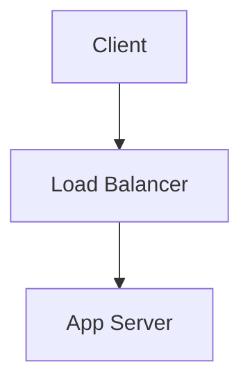

Here's a **Markdown Cheat Sheet** covering almost everything you'll commonly use on GitHub, README files, documentation, notes, and technical blogs.

> ##  Double Space bar for next line.

# 1. Headings

```md
# Heading 1
## Heading 2
### Heading 3
#### Heading 4
##### Heading 5
###### Heading 6
```

Output:

# Heading 1

## Heading 2

### Heading 3

---

# 2. Text Formatting

```md
**Bold**

*Italic*

***Bold + Italic***

~~Strikethrough~~

`Inline Code`
```

Output:

**Bold**

*Italic*

***Bold + Italic***

~~Strikethrough~~

`Inline Code`

---

# 3. Paragraphs & Line Breaks

```md
This is paragraph one.

This is paragraph two.
```

Blank line = new paragraph.

---

# 4. Blockquotes

```md
> This is a quote.
```

Output:

> This is a quote.

Nested:

```md
> Main quote
>> Nested quote
```

Output:

> Main quote
>
> > Nested quote

---

# 5. Lists

## Unordered List

```md
- Apple
- Banana
- Mango
```

or

```md
* Apple
* Banana
* Mango
```

Output:

* Apple
* Banana
* Mango

---

## Ordered List

```md
1. First
2. Second
3. Third
```

Output:

1. First
2. Second
3. Third

---

## Nested List

```md
1. Fruits
   - Apple
   - Mango
2. Vegetables
   - Potato
```

Output:

1. Fruits

   * Apple
   * Mango
2. Vegetables

   * Potato

---

# 6. Task Lists (GitHub)

```md
- [x] Learn Arrays
- [x] Learn Strings
- [ ] Learn Trees
```

Output:

* [x] Learn Arrays
* [x] Learn Strings
* [ ] Learn Trees

---

# 7. Horizontal Rule

```md
---
```

or

```md
***
```

or

```md
___
```

Output:

---

---

# 8. Links

```md
[Google](https://google.com)
```

Output:

[Google](https://google.com)

---

# 9. Images

```md

```

Example:

```md

```

---

# 10. Code

## Inline

```md
Use `vector<int>` in C++.
```

Output:

Use `vector<int>` in C++.

---

## Code Block

<pre>
```cpp
int main() {
    cout << "Hello";
}
```
</pre>

Output:

```cpp
int main() {
    cout << "Hello";
}
```

---

# 11. Syntax Highlighting

Supports many languages:

<pre>
```python
print("Hello")
```
</pre>

<pre>
```cpp
cout << "Hello";
```
</pre>

<pre>
```java
System.out.println("Hello");
```
</pre>

---

# 12. Tables

```md
| Name | Age |
|------|------|
| John | 20 |
| Alice | 22 |
```

Output:

| Name  | Age |
| ----- | --- |
| John  | 20  |
| Alice | 22  |

---

## Alignment

```md
| Left | Center | Right |
|:-----|:------:|------:|
| A | B | C |
```

Output:

| Left | Center | Right |
| :--- | :----: | ----: |
| A    |    B   |     C |

---

# 13. Escaping Characters

Want to show markdown symbols literally?

```md
\*
\#
\`
```

Output:

*
#
`

---

# 14. HTML Inside Markdown

Markdown supports HTML.

```md
<b>Bold</b>

<i>Italic</i>

<br>
```

Output:

<b>Bold</b>

<i>Italic</i>

---

# 15. Collapsible Sections (GitHub)

```md
<details>
<summary>Click Me</summary>

Hidden content here.

</details>
```

Output:

<details>
<summary>Click Me</summary>

Hidden content here.

</details>

---

# 16. Emoji (GitHub)

```md
:rocket:
:smile:
:fire:
:star:
```

Output:

🚀 😄 🔥 ⭐

---

# 17. Mentions (GitHub)

```md
@username
```

Mentions a user.

---

# 18. References / Anchors

```md
# Installation

Jump to [Installation](#installation)
```

Useful for README navigation.

---

# 19. Checkboxes in README Roadmaps

```md
## DSA Progress

- [x] Arrays
- [x] Strings
- [ ] Trees
- [ ] Graphs
```

---

# 20. GitHub Alerts (Supported in many GitHub docs)

```md
> [!NOTE]
> Useful information.

> [!TIP]
> Helpful advice.

> [!WARNING]
> Be careful.

> [!IMPORTANT]
> Critical information.
```

Example:

> [!WARNING]
> Never commit API keys.

---

# README Template for Projects

````md
# Project Name

## Description

Brief explanation.

## Features

- Feature 1
- Feature 2

## Installation

```bash
git clone repo-url
cd project
npm install
````

## Usage

```bash
npm start
```

## Tech Stack

* React
* Node.js
* MongoDB

## Author

Your Name

````

---

# For a Final-Year CSE Student

The Markdown features you'll use 95% of the time are:

```md
# Headings

**Bold**

`Code`

```cpp
Code Blocks
````

* Lists

* [ ] Checkboxes

| Tables |

[Links](...)


> Quotes

---

```

Master those and you'll be able to write professional GitHub READMEs, project documentation, notes, and technical blogs.
```

---

# Additional Markdown Features & Tips

## Table of Contents (manual)
Create quick navigation by linking to headings:

```md
- [Installation](#installation)
- [Usage](#usage)
- [Contributing](#contributing)
```

## Mermaid diagrams
GitHub supports Mermaid. Use fenced blocks with `mermaid`:



## Math (KaTeX / LaTeX)
Use `$...$` for inline math and `$$...$$` for display math where the renderer supports it (may require additional tooling or GitHub Pages setup):

```md
Inline: $E = mc^2$

Block:
$$
\int_0^1 x^2 \,dx = \frac{1}{3}
$$
```

## Footnotes (when supported)
```md
Here is a statement.[^1]

[^1]: Footnote text.
```

## Definition lists (HTML fallback)
Not all Markdown engines support this natively—use HTML if needed:

```html
<dl>
   <dt>HTTP</dt>
   <dd>HyperText Transfer Protocol</dd>
</dl>
```

## Badges (shields)
Add project status, build, or coverage badges at the top of README:

```md

```

## Accessibility & images
- Always include clear alt text for images: ``
- Prefer SVG for diagrams so they scale and remain accessible.

## Small authoring tips
- Keep README top section short and actionable.
- Use short code examples and link to deeper docs.
- Maintain a one-line summary and a TL;DR at the top.

# Example of code writing
```cpp
class Solution {
public:
    int reverse(int x) {

        // TODO: Handle overflow more cleanly

        string s = to_string(x);

        // FIXME: Negative numbers are not handled properly

        reverse(s.begin(), s.end());

        // REVIEW: Is stoi the best choice here?
        int ans = stoi(s);

        // NOTE: LeetCode expects 0 on overflow

        return ans;
    }
};
```