# 🏗️ System Design Crash Course

A visual, from-scratch system design course — starting with a single client-server pair and progressively building into a full production-grade architecture.

All diagrams are hand-crafted in [Excalidraw]so you can open, annotate, and learn hands-on.

---

## 📚 Table of Contents

1. [Basic Client-Server Architecture](#1-basic-client-server-architecture)
2. [Vertical vs Horizontal Scaling](#2-vertical-vs-horizontal-scaling)
3. [Load Balancer](#3-load-balancer)
4. [CDN (Content Delivery Network)](#4-cdn-content-delivery-network)
5. [Caching with Redis](#5-caching-with-redis)
6. [Database Replication](#6-database-replication)
7. [Database Sharding](#7-database-sharding)
8. [Message Queues & Async Processing](#8-message-queues--async-processing)
9. [Blob Storage (S3)](#9-blob-storage-s3)
10. [Consistent Hashing](#10-consistent-hashing)
11. [WebSockets, Short Polling & SSE](#11-websockets-short-polling--server-sent-events)
12. [Idempotency Keys](#12-idempotency-keys)
13. [CAP Theorem](#13-cap-theorem)
14. [Full Production Architecture](#14-full-production-architecture)

---

## 1. Basic Client-Server Architecture

The foundation of everything. When you type a URL into your browser, what actually happens?

- **DNS Resolution** — `example.com` gets resolved to an IP like `192.15.16.23` by a DNS Resolver
- **HTTP Request** — your browser (client) sends a request to that IP
- **HTTP Response** — the server responds with data (HTML, JSON, etc.)

Every system design starts here — a client talking to a server.

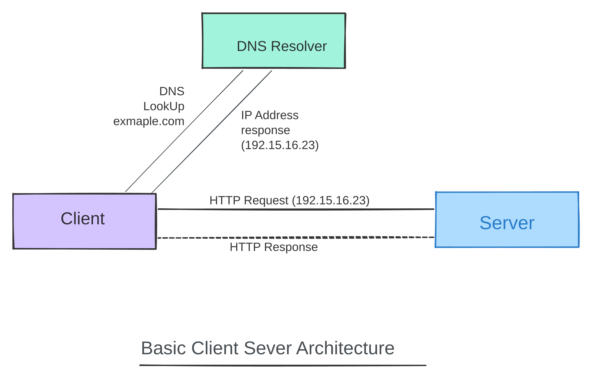

---

## 2. Vertical vs Horizontal Scaling

Your app is getting popular. The single server can't keep up. What do you do?

**Vertical Scaling** — give the server more power (more CPU, more RAM). Simple, but:
- Has a physical ceiling
- Single point of failure — if it goes down, everything goes down

**Horizontal Scaling** — add more servers. If one goes down, the others are still up. The service stays alive.

> At scale, horizontal scaling always wins.

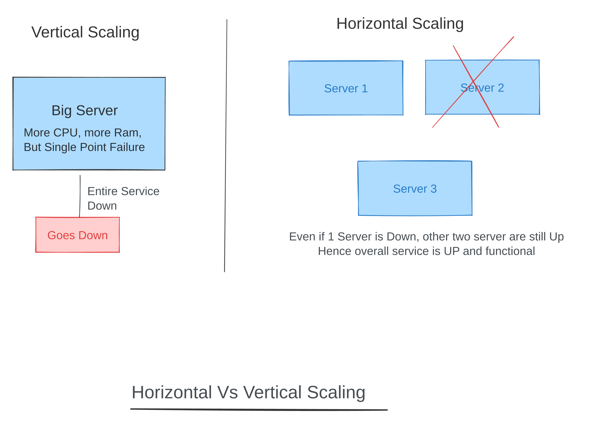

---

## 3. Load Balancer

With multiple servers, how does traffic know which server to go to? That's the Load Balancer's job.

**Layer 4 (Transport Layer)**
- Routes based on IP/port
- Fast and lightweight — no packet inspection
- Doesn't know about HTTP, URLs, or cookies

**Layer 7 (Application Layer)**
- Routes based on URL path, headers, cookies
- Can send `/api` to one server pool and `/static` to another
- Supports Round Robin distribution + Health Checks (automatically stops sending traffic to a failed server)

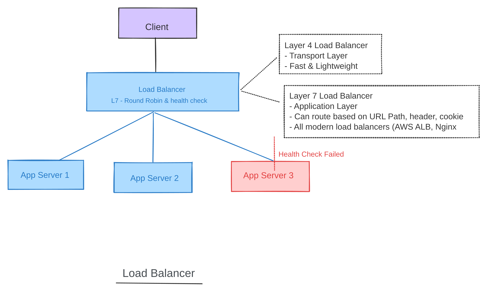

---

## 4. CDN (Content Delivery Network)

Without a CDN, a user in Singapore hitting your US-East server has massive latency. Every request travels across the world.

A CDN fixes this with **Edge Nodes (PoPs)** — servers placed close to users around the world.

- **Cache Hit** → asset is already at the edge node, served immediately
- **Cache Miss** → edge node fetches from your origin server, caches it for the next user

**What goes on a CDN:**
- Images, videos, audio files
- JavaScript bundles and CSS
- Fonts
- Any static asset that doesn't change per-user

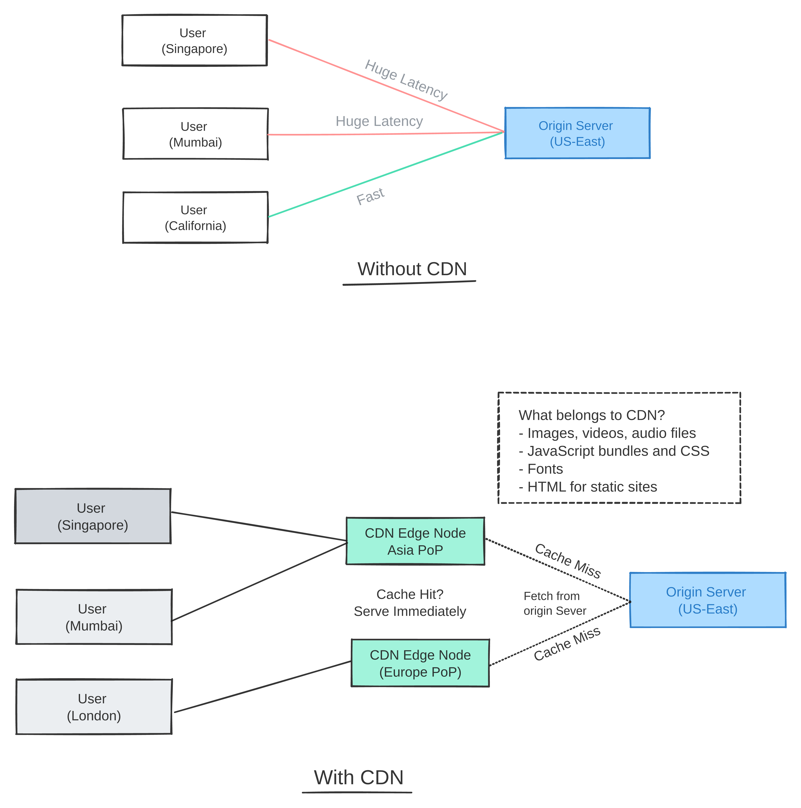

---

## 5. Caching with Redis

Your database is the bottleneck. Most reads are for the same popular data. Caching solves this.

- App server checks **Redis cache first** (~1ms response)
- **Cache Hit** → return data immediately, skip the DB entirely
- **Cache Miss** → fetch from DB, populate the cache, return data

**Eviction strategies:**
- **LRU (Least Recently Used)** — when cache is full, evict the least recently accessed item
- **TTL (Time To Live)** — automatically expire cached data after a set time

> Cache-aside is the most common pattern: the app manages what goes into the cache.

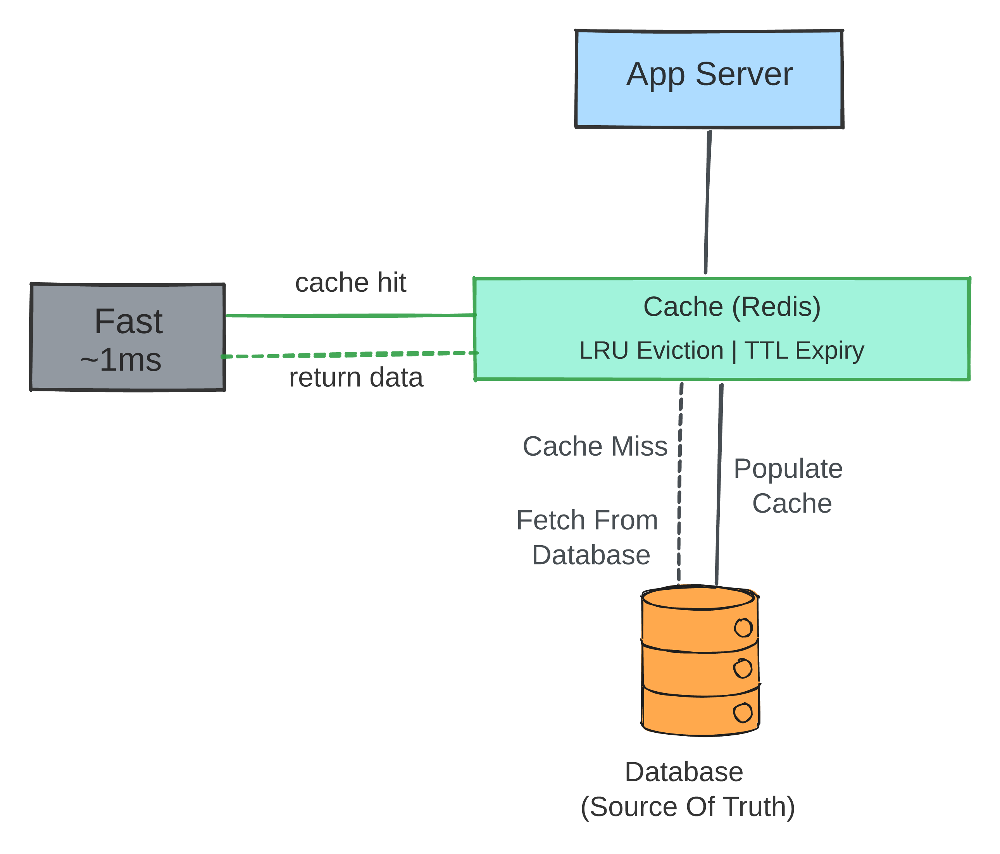

---

## 6. Database Replication

One database can't handle everything. Reads and writes need to scale separately.

- **Primary DB** — handles all writes. Single source of truth.
- **Read Replicas** — copies of the primary. Handle all reads. Can have many of them.

**Failure Case:**
- If the Primary DB dies, **Leader Election** kicks in — one of the replicas is promoted to become the new Primary automatically.

> Replication gives you read scalability + automatic failover.

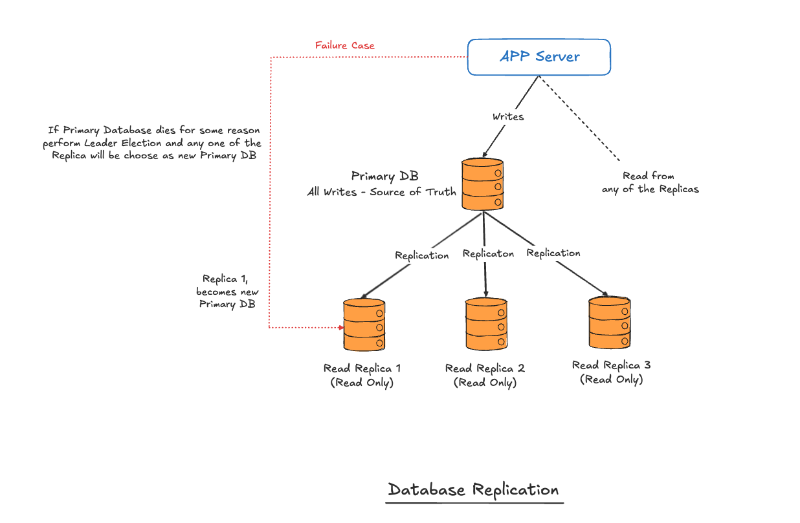

---

## 7. Database Sharding

Even with replication, one primary DB has a write ceiling. Sharding breaks the data itself across multiple databases.

- **Shard 1** → Users A–M
- **Shard 2** → Users N–Z
- Routing is decided by `hash(user_id)` — any app server can figure out which shard to hit

Each shard has its own **Primary + Read Replicas**, so you get both write scaling and read scaling, with independent failover per shard.

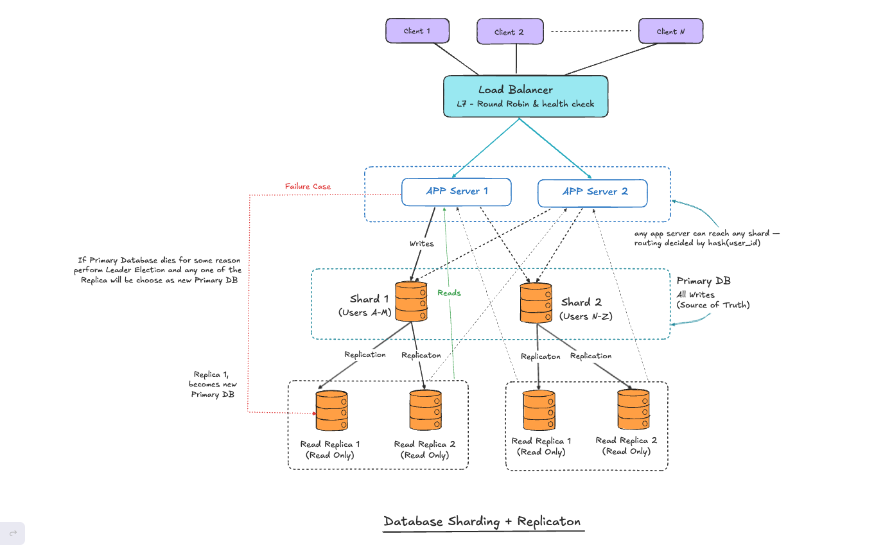

---

## 8. Message Queues & Async Processing

**Without a queue (synchronous):**

When a user uploads a photo, your server does everything inline:
1. Resize image → 800ms
2. Compress image → 600ms
3. Generate thumbnail → 400ms
4. Update database → 50ms

The user waits ~3–4 seconds staring at a spinner. This is a terrible design.

**With a queue (asynchronous):**

1. App server drops a job on the queue → returns a response in **~30ms**
2. Workers pick up jobs independently and run in parallel in the background:
   - Image Worker: resize + compress + thumbnails (~1.2s)
   - Email Worker: "photo uploaded" confirmation (~1.4s)
   - DB Worker: update photo record (~50ms)
   - Analytics Worker: log the event (~300ms)

**Fault tolerance:** if a worker crashes mid-job, the message goes back onto the queue and gets picked up again. No data loss.

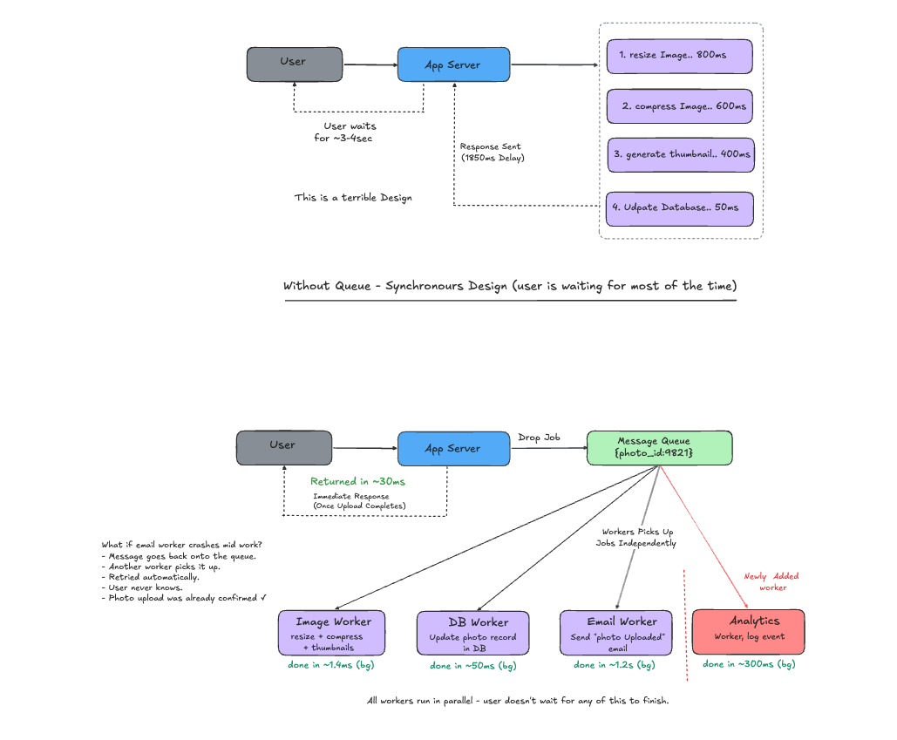

---

## 9. Blob Storage (S3)

You should never store images, videos, or large files in your database. Use Blob Storage (like AWS S3).

**The flow:**
1. Client tells your app server it wants to upload a file
2. App server issues a **pre-signed URL** — a temporary URL that gives the client direct upload permission to S3
3. Client uploads the file **directly to S3** — bypasses your servers entirely
4. A DB Worker writes the S3 file URL to your database

Files are served back to users **via CDN**, not directly from S3.

> Your DB stores URLs only. S3 stores the actual bytes.

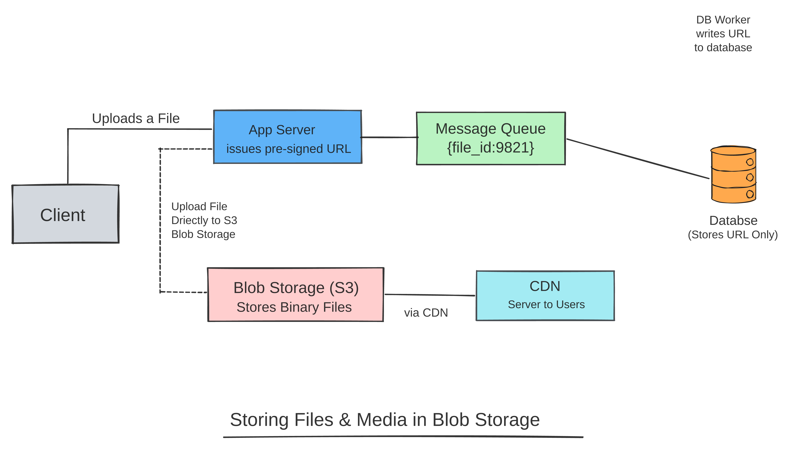

---

## 10. Consistent Hashing

When you have many servers and need to distribute keys across them, naive hashing (`key % N`) breaks down — adding or removing a server reshuffles ~75% of all keys.

**Consistent Hashing** solves this:
- Servers and keys are placed on a **virtual ring**
- Each key belongs to the first server clockwise from it on the ring
- Adding/removing a server only affects ~1/N of keys

**Virtual Nodes** — each physical server appears multiple times on the ring, which spreads load more evenly and prevents hotspots.

> Naive hashing: 75% of keys move. Consistent hashing: ~1/N keys move.

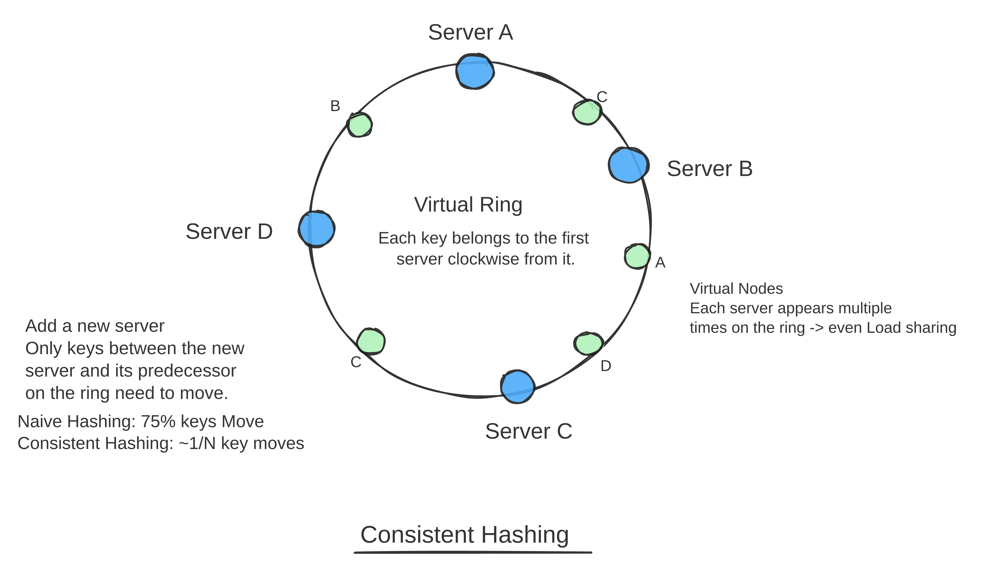

---

## 11. WebSockets, Short Polling & Server-Sent Events

Three patterns for real-time communication between client and server:

| Pattern | Direction | Overhead | Use Cases |
|---|---|---|---|
| **Short Polling** | Client repeatedly asks | Very high — most requests return nothing | Simple status checks |
| **WebSockets** | Bidirectional | Low | Chat, multiplayer games, live collaboration |
| **Server-Sent Events (SSE)** | Server → Client only | Low | Notifications, live feeds, stock tickers |

Short polling is wasteful. WebSockets are powerful but complex. SSE is the sweet spot for one-way real-time updates.

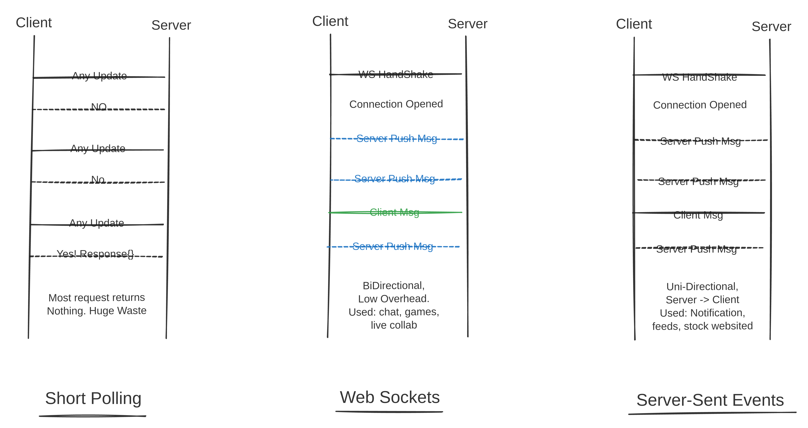

---

## 12. Idempotency Keys

**The problem:** User pays $100. Network dies after the charge goes through but before the response arrives. Client retries. User gets charged $200.

Without an idempotency key, your server has no way to know if an incoming request is a retry.

**The fix:**
1. Client generates a UUID **before** the request: `pay-uuid-a3f9c2`
2. Client sends it as a header: `Idempotency-Key: pay-uuid-a3f9c2`
3. Client sends this same key on every retry
4. Server checks Redis for the key
   - **Found** → return the cached result. No second charge.
   - **Not found** → process + store the result in Redis

> User is charged exactly once, even after multiple retries.

Used by: Stripe, PayPal, Braintree — for every payment API.

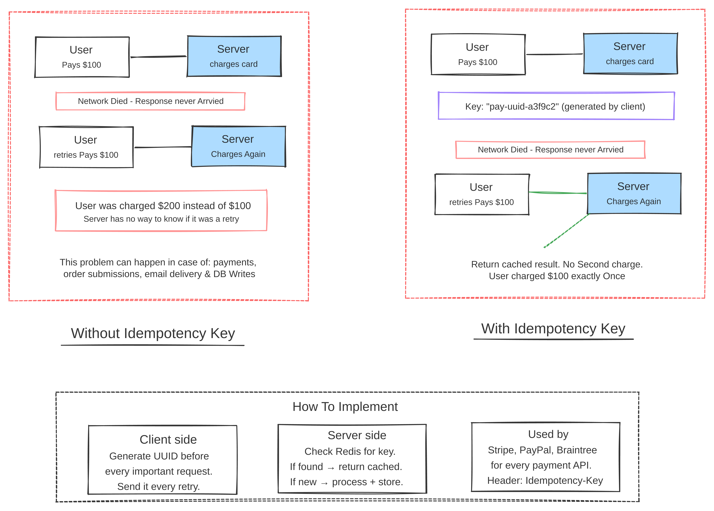

---

## 13. CAP Theorem

In any distributed system, you can only fully guarantee **two** of these three properties:

- **C**onsistency — every read returns the most recent write
- **A**vailability — every request gets a response (even if it might be stale)
- **P**artition Tolerance — the system keeps working even if the network splits

**The catch:** In real distributed systems, network partitions happen. You cannot choose to ignore P. So the real choice is:

- **CP** (Consistency + Partition Tolerance) → prefer correct data over availability. If unsure, return an error. Used by: banks, financial systems.
- **AP** (Availability + Partition Tolerance) → prefer a response even if it might be slightly stale. Used by: analytics systems, social feeds.
- **CA** → not achievable in a distributed system.

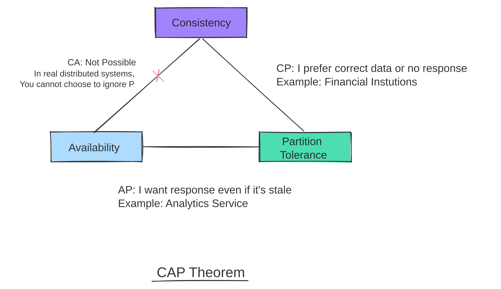

---

## 14. Full Production Architecture

Now let's put it all together. This is what a production system looks like after applying everything above:

```
User Request
    │
    ▼
  DNS ──────────────────► CDN (static assets served at edge)
    │
    ▼
Load Balancer (L7 — Round Robin + Health Checks)
    │
    ├─► App Server 1 (stateless)
    ├─► App Server 2 (stateless)   ──► Cache (Redis) ──► DB (on hit)
    └─► App Server 3 (stateless)        │
                                        │ (cache miss)
                                        ▼
                                   Message Queue
                                        │
                                   Workers (async)
                                        │
                              ┌─────────┴──────────┐
                              ▼                    ▼
                         Blob Storage (S3)     DB Shard 1 (A–M)
                              │                Primary + Replicas
                              ▼                DB Shard 2 (N–Z)
                             CDN               Primary + Replicas
```

Every component in this diagram is a concept from earlier in this course.

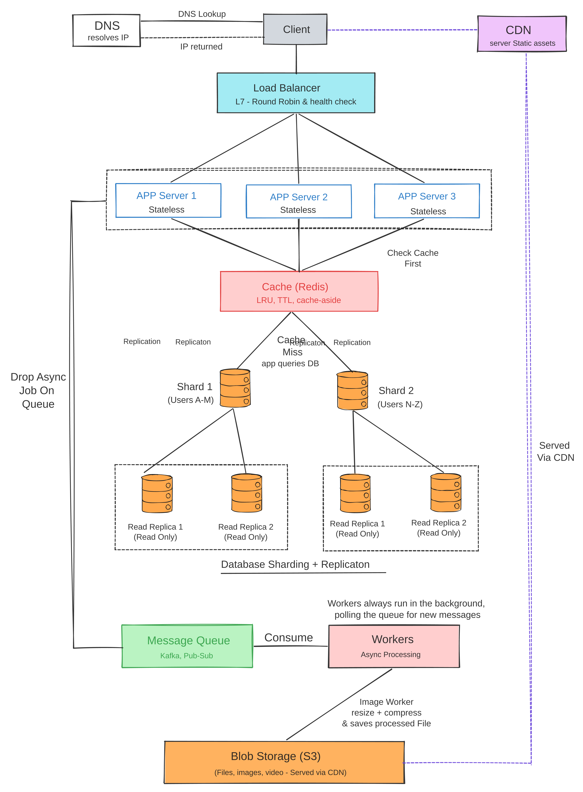

---

## 🛠️ How to Use These Diagrams

**Open a single module:**
1. Go to [excalidraw.com](https://excalidraw.com)
2. Menu (☰) → Open → select any `diagrams/XX-module-name.excalidraw`

**Open the full canvas:**
- 🔗 [Open in Excalidraw (shared link)](https://excalidraw.com/#json=wqTShX-e_r4SJJZvub2vN,3F0sriwyP-3-PJIBQdpENA)

All `.excalidraw` files are plain JSON — fully version-controllable and remixable.

---

## 🤝 Contributing

PRs welcome! See [CONTRIBUTING.md](CONTRIBUTING.md).

---

*Built with [Excalidraw](https://excalidraw.com) • MIT License*
